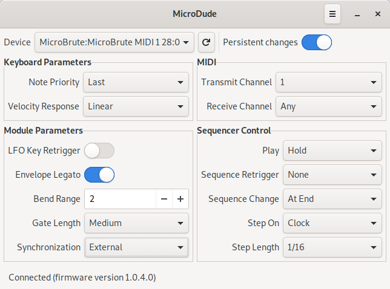

# MicroDude

MicroDude is an editor for Arturia MicroBrute. It offers all the functionality of Arturia MicroBrute Connection but the firmware upload and the factory patterns reset.



Also, it is possible to use MicroDude from other Python programs.

## Additional features

- Pitch and modulation wheels calibration

## Installation

MicroDude is a Python package that is installed the standard way with `python3 setup.py install`. However, as it contains desktop application related resources, it is installed with `make`.

The package dependencies for Debian based distributions are:
- make
- python3
- python3-setuptools
- python3-mido
- python3-rtmidi
- gettext

You can easily install them by running `sudo apt-get install make python3 python3-setuptools python3-mido python3-rtmidi gettext`.
sIn case `python-rtmidi` is not available, `PortMidi` will be used as the backend. You can install it with `sudo apt-get install libportmidi-dev`.

To install MicroDude simply run `make && sudo make install`.

## Usage of the Python interface

If you want have direct access to the MicroBrute you can use the `Connector` class in the python package this way.

Firstly, to connect to the MicroBrute you have to proceed the following way.
```
$ python3
>>> from microdude import connector
>>> connector.get_ports()
['MicroBrute:MicroBrute MIDI 1 28:0', 'MicroBrute:MicroBrute MIDI 2 28:1', 'Midi Through:Midi Through Port-0 14:0']
>>> c = connector.Connector()
>>> c.connect('MicroBrute:MicroBrute MIDI 1 28:0')
```
From here, it is possible to get or set parameters or sequences.
```
>>> c.set_parameter(connector.BEND_RANGE, 12)
True
>>> c.get_parameter(connector.BEND_RANGE)
12
>>> c.set_sequence('7:36 x x 36 x x 36 x x 36 x x 32 x 39 x')
>>> c.get_sequence(6)
'7:36 x x 36 x x 36 x x 36 x x 32 x 39 x'
```
Notice that while the `get_sequence` method is 0 based index the sequence string returned follows the Arturia specifications and is 1 based index.

Lastly, you can close the connector to free the resources.
```
>>> c.disconnect()
```

## How to add a new localization

To add a new translation file for locale X, run `msginit -i locale/messages.pot -o locale/X.po`.

In case there are new texts to be translated, the pot file needs to be updated. To do this, run `make update_pot`.

## Documentation

You can find the SysEx documentation in `doc/sysex`.
